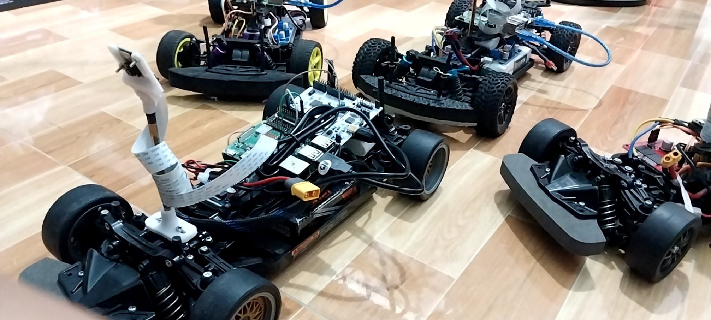
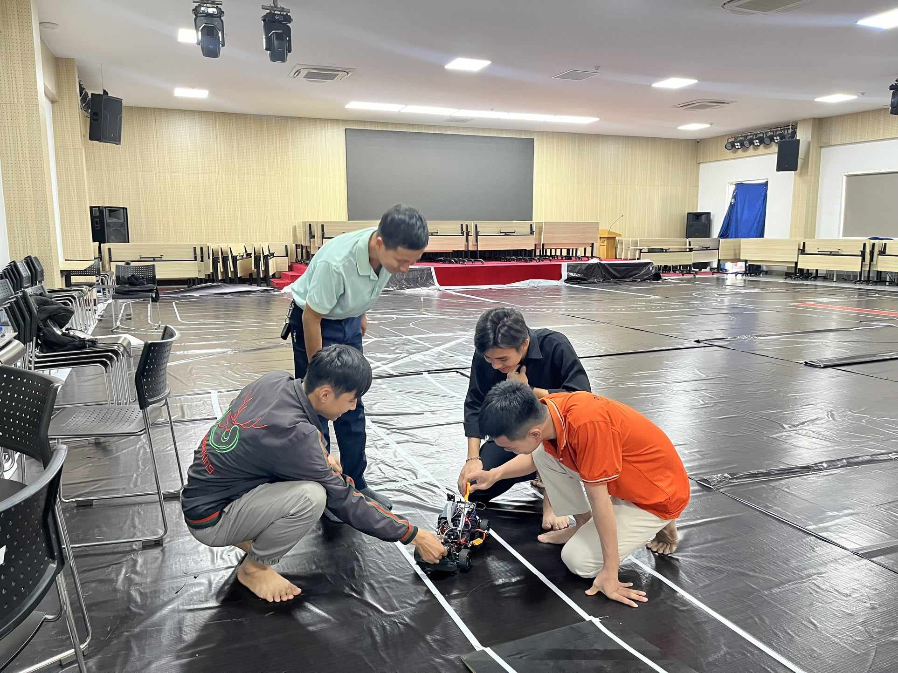
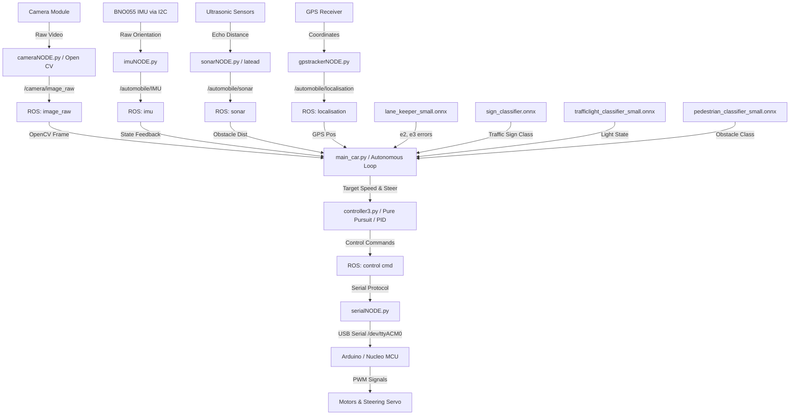
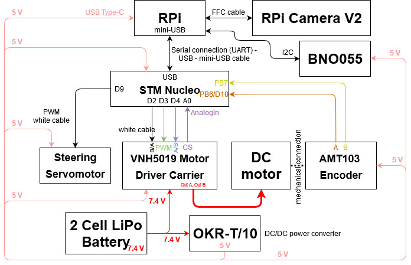
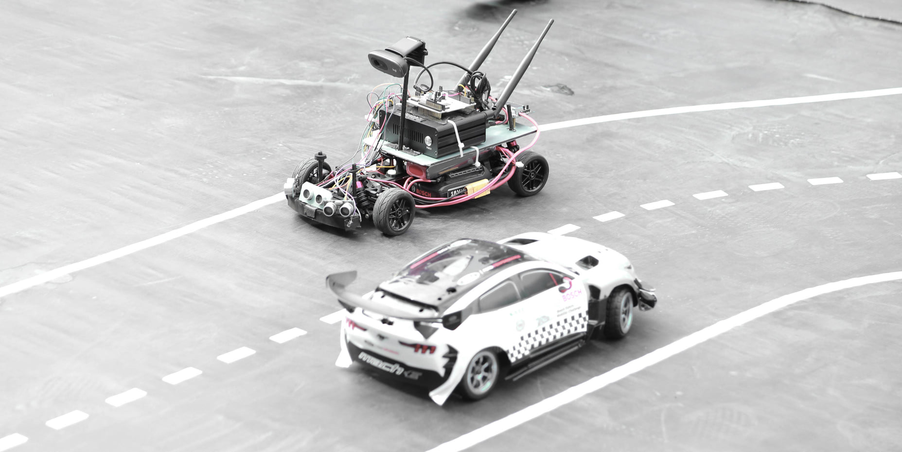
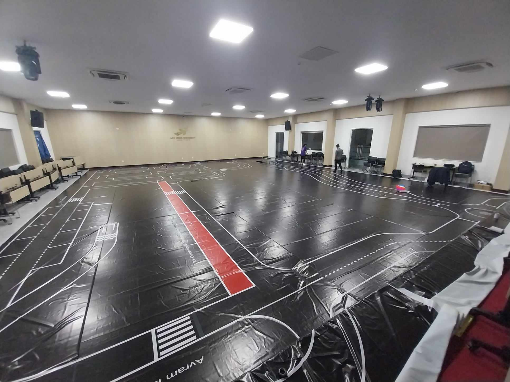

# Autopilot & Full Self-Driving (FSD) for Scale-Model Autonomous Car
*Autonomous scale-model vehicle control stack with lane-keeping based on ROS and Deep Learning*

**Team Leader:** Bui Minh Cuong (Michael)

---

## 🎥 Demo Videos

<div align="center">

### Demo 1

https://github.com/user-attachments/assets/62666148-59db-41df-be0a-458ea7d33234

<br />

### Demo 2

https://github.com/user-attachments/assets/5e97863c-4eaa-4ee6-837f-ccc63fc53065

</div>

<br />

- [Demo Video 1 on Google Drive](https://drive.google.com/file/d/1xopJRtY4oJ2lKirMBOqHJgrE3sD4T-gK/view?usp=drive_link)
- [Demo Video 2 on Google Drive](https://drive.google.com/file/d/1GvKed1f2F6sQnUh5rFhaf8miBfDAbKWN/view?usp=sharing)
---

*For the Vietnamese version of this document, please see [README_VN.md](README_VN.md).*

---

<table>
  <tr>
    <td align="center"><b>Scale Model Autonomous Car</b></td>
    <td align="center"><b>Development Workspace</b></td>
  </tr>
  <tr>
    <td></td>
    <td></td>
  </tr>
</table>

---

> [!NOTE]
> This project is open-source and no longer intended for commercial use. It serves as an academic and research reference for developing scale-model autonomous vehicles using Robot Operating System (ROS) and Deep Learning models on embedded platforms (Raspberry Pi & Arduino/Nucleo).

---

## 🏆 Project Background & Achievements

This repository contains the autonomous driving stack developed for the **Bosch Future Mobility Challenge (BFMC) 2024 & 2025**, currently ranked **Top 15 in the world**.

In 2024, due to unforeseen visa complications, the team from Vietnam was unable to travel to Romania for the physical finals. In response, we chose to release our complete codebase as open-source for the research community and robotics enthusiasts worldwide.

Furthermore, scale-model autonomous vehicles based on this platform were successfully commercialized for research institutes and educational purposes, generating approximately **$4,000 USD** in revenue.

---

## 🗺️ System Architecture



---

## 🔌 Hardware Connections

To run the vehicle successfully, establish all sensor and microcontroller connections according to the schematic below:

<p align="center">
  
</p>

---

## 🏁 Test Track & Mapping

The system was tested on the official BFMC track layout with a local GPS localization map, lane markings, and traffic signs:

<table>
  <tr>
    <td align="center"><b>Physical Track</b></td>
    <td align="center"><b>Localization Map</b></td>
  </tr>
  <tr>
    <td></td>
    <td></td>
  </tr>
</table>

---

## 📂 Repository Directory Structure

```
Autopilot_and_FSD/
├── .catkin_workspace        # ROS catkin configuration file
├── LICENSE                  # License terms
├── README.md                # English system documentation (this file)
├── README_VN.md             # Vietnamese system documentation
├── network_conf_auto.bash   # Network configuration script
├── assets/                  # Images and diagrams
└── src/
    ├── action/              # High-level motion planning and maneuvers
    │   └── src/action/      # Maneuver implementations (overtaking, parking, etc.)
    ├── control/             # Low-level control interfaces and drivers
    │   └── src/control/     # Car data and state machine interfaces
    ├── input/               # Sensor interface nodes (Camera, IMU, GPS, Sonar, V2V)
    ├── output/              # MCU communication and serial interfaces (C++ / Python)
    ├── perception/          # Lane detection and computer vision package placeholders
    ├── rosserial_python/    # ROS standard rosserial communication protocol package
    ├── utils/               # Launch scripts, custom message/service definitions, requirements
    │   ├── launch/          # Launch configurations (*.launch)
    │   ├── msg/             # Custom message types (*.msg)
    │   ├── srv/             # Custom service types (*.srv)
    │   └── requirements.txt # Python dependency file
    └── tests/
        └── lane_keeping_6_cv_camera/   # Main autonomous driving and lane-keeping demo
            ├── models/                 # Pre-trained ONNX and PyTorch weights
            ├── main_car.py             # Main execution loop
            ├── detection.py            # Deep learning inference pipeline (ONNX Runtime)
            ├── controller3.py          # Steering (Pure Pursuit) and speed controller
            ├── maneuvers.py            # Local maneuver planner
            └── automobile_data.py      # ROS topic I/O manager
```

---

## 🛠️ System Installation Guide

### 1. Download & Mount Raspberry Pi OS
Download Raspberry Pi OS (Desktop or Lite version) from [Raspberry Pi Software](https://www.raspberrypi.com/software/operating-systems/). Mount the image file to your SD card using [Balena Etcher](https://www.balena.io/etcher/).

### 2. Network & SSH Setup
Create a `wpa_supplicant.conf` file at the root of the SD card (boot partition) to automatically connect to Wi-Fi on boot:

```ini
ctrl_interface=DIR=/var/run/wpa_supplicant GROUP=netdev
update_config=1
country=VN

network={
    ssid="YOUR_WIFI_SSID"
    psk="YOUR_WIFI_PASSWORD"
}
```

Create empty files named `ssh`, `i2c`, and `camera` in the boot partition of the SD card to enable these interfaces automatically.

---

### 3. Install ROS Noetic (on Raspberry Pi Buster)

```bash
# Add ROS Debian repository
sudo sh -c 'echo "deb http://packages.ros.org/ros/ubuntu buster main" > /etc/apt/sources.list.d/ros-noetic.list'

# Add official ROS key
sudo apt-key adv --keyserver 'hkp://keyserver.ubuntu.com:80' --recv-key C1CF6E31E6BADE8868B172B4F42ED6FBAB17C654

# Update package lists
sudo apt-get update && sudo apt-get upgrade -y

# Install build dependencies
sudo apt-get install -y python-rosdep python-rosinstall-generator python-wstool python-rosinstall build-essential cmake python3-pip libopencv-dev python3-opencv

# Initialize rosdep
sudo rosdep init
rosdep update
```

#### Fetch & Compile ROS Noetic (Lite Version)
```bash
mkdir -p ~/ros_catkin_ws
cd ~/ros_catkin_ws

# Generate ROS Lite packages list
rosinstall_generator ros_comm sensor_msgs cv_bridge --rosdistro noetic --deps --wet-only --tar > noetic-ros_comm-wet.rosinstall 
wstool init src noetic-ros_comm-wet.rosinstall

# Optional: Increase swap space to 1GB to prevent compiler out-of-memory
sudoedit /etc/dphys-swapfile  # Change CONF_SWAPSIZE=100 to CONF_SWAPSIZE=1024
sudo dphys-swapfile swapoff && sudo dphys-swapfile setup && sudo dphys-swapfile swapon

# Build and install ROS
sudo src/catkin/bin/catkin_make_isolated --install -DCMAKE_BUILD_TYPE=Release --install-space /opt/ros/noetic -j1 -DPYTHON_EXECUTABLE=/usr/bin/python3
```

#### Add ROS path to environment
```bash
echo "source /opt/ros/noetic/setup.bash" >> ~/.bashrc
source ~/.bashrc
```

---

### 4. Setup Python Dependencies
Install the required Python packages using the `requirements.txt` located under `src/utils/`:

```bash
# Install system packages
sudo apt install -y libatlas-base-dev

# Install Python requirements
cd ~/Autopilot_and_FSD
pip3 install -r src/utils/requirements.txt
pip3 install numpy --upgrade
```

---

### 5. Setup I2C Interface for BNO055 IMU
Follow the Raspberry Pi setup from the [RTIMULib repository](https://github.com/RPi-Distro/RTIMULib/tree/master/Linux) to configure I2C for the BNO055 IMU sensor.

---

## 🚀 Building & Running the Demo

### 1. Compile Workspace
Use `catkin_make` to compile the entire ROS workspace:

```bash
cd ~/Autopilot_and_FSD
catkin_make
source devel/setup.bash
```

### 2. Launch Core Car Interface Nodes
Run the remote car launch configuration to start the sensors and controller interface:

```bash
roslaunch utils run_automobile_remote.launch
```

### 3. Run Autonomous Driving Demo
Open a new terminal, navigate to the demo directory, and execute the autonomous driving script:

```bash
cd ~/Autopilot_and_FSD/src/tests/lane_keeping_6_cv_camera
python3 main_car.py
```

---

## 🧠 Perception Deep Learning Models

Models are deployed as `.onnx` files in the folder `src/tests/lane_keeping_6_cv_camera/models/`:

| Model Name | Format | Task |
| :--- | :--- | :--- |
| `lane_keeper_small.onnx` | ONNX | Estimates lateral offset ($e_2$) and heading error ($e_3$) relative to the center of the lane. |
| `stop_line_estimator.onnx` | ONNX | Estimates the distance from the vehicle to the upcoming stop line. |
| `local_path_estimator.onnx` | ONNX | Estimates a sequence of local path waypoints to guide vehicle navigation. |
| `sign_classifier.onnx` | ONNX | Identifies 9 traffic sign classes: `park`, `closed_road`, `highway_exit`, `highway_enter`, `stop`, `roundabout`, `priority`, `cross_walk`, `one_way`. |
| `trafficlight_classifier_small.onnx` | ONNX | Detects and classifies the state of traffic lights (Green, Yellow, Red). |
| `pedestrian_classifier_small.onnx` | ONNX | Classifies frontal obstacles (pedestrian, roadblock, other vehicles). |

---

## 📝 Contact & License
All copyrights belong to **Duong Minh Ngoc Phat Corporation**. Contact us for more details.

*Copyright © 2024 Duong Minh Ngoc Phat Corporation. All Rights Reserved.*
