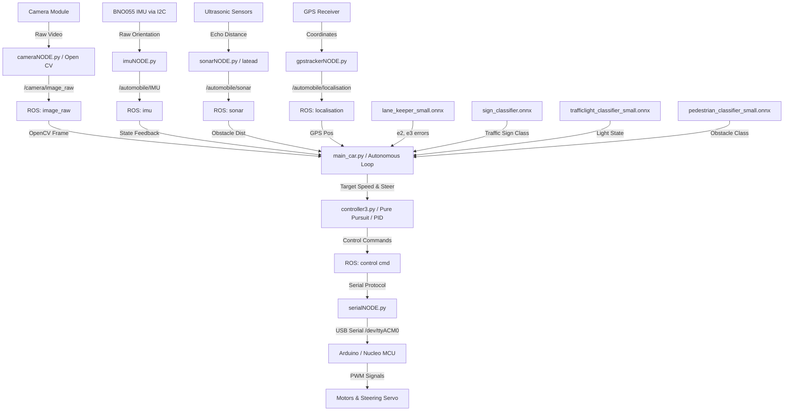

# Autopilot & Full Self-Driving (FSD) for Scale-Model Autonomous Car
*Dự án điều khiển xe tự hành mô hình với khả năng tự lái và giữ làn dựa trên ROS và Deep Learning*

---

<table>
  <tr>
    <td align="center"><b>Scale Model Autonomous Car / Mô hình xe tự hành</b></td>
    <td align="center"><b>Development Workspace / Không gian phát triển</b></td>
  </tr>
  <tr>
    <td></td>
    <td></td>
  </tr>
</table>

---

> [!NOTE]
> **Vietnamese:** Dự án này đã được mã nguồn mở (open-source) và hiện không còn sử dụng cho mục đích thương mại. Đây là tài liệu học thuật hữu ích để nghiên cứu và phát triển xe tự hành sử dụng hệ điều hành Robot (ROS) và các mô hình học sâu (Deep Learning) trên phần cứng nhúng (Raspberry Pi & Arduino/Nucleo).
>
> **English:** This project is open-source and no longer intended for commercial use. It serves as an academic and research reference for developing scale-model autonomous vehicles using Robot Operating System (ROS) and Deep Learning models on embedded platforms (Raspberry Pi & Arduino/Nucleo).

---

## 🏆 Project Background & Achievements / Lịch sử dự án & Thành tựu

*   **Vietnamese:**
    Dự án này là mã nguồn mở cho hệ thống tự hành của đội tuyển tham dự cuộc thi **Bosch Future Mobility Challenge (BFMC) 2024 & 2025**, hiện đang xếp hạng **Top 15 thế giới**.
    Vào năm 2024, do một số trục trặc ngoài ý muốn về thủ tục Visa, đội tuyển Việt Nam đã không thể lên đường tới Romania tham dự vòng chung kết trực tiếp. Để tiếp tục đóng góp cho cộng đồng phát triển xe tự hành và những người đam mê công nghệ, chúng tôi quyết định mở kho tài liệu và mã nguồn này dưới dạng mã nguồn mở cho cộng đồng.
    Bên cạnh đó, các mô hình xe tự hành dựa trên nền tảng này đã được thương mại hóa thành công cho các đơn vị giáo dục, nghiên cứu, mang lại doanh thu khoảng **$4,000 USD** để phát triển công nghệ.

*   **English:**
    This repository contains the autonomous driving stack developed for the **Bosch Future Mobility Challenge (BFMC) 2024 & 2025**, currently ranked **Top 15 in the world**.
    In 2024, due to unforeseen visa complications, the team from Vietnam was unable to travel to Romania for the physical finals. In response, we chose to release our complete codebase as open-source for the research community and robotics enthusiasts worldwide.
    Furthermore, scale-model autonomous vehicles based on this platform were successfully commercialized for research institutes and educational purposes, generating approximately **$4,000 USD** in revenue.

---

## 🗺️ System Architecture / Kiến trúc hệ thống



---

## 🔌 Hardware Connections / Sơ đồ kết nối phần cứng

Để xe có thể hoạt động chính xác, các cảm biến và mạch vi điều khiển cần được kết nối theo sơ đồ phần cứng dưới đây:

<p align="center">
  
</p>

---

## 🏁 Test Track & Mapping / Đường chạy & Bản đồ thử nghiệm

Hệ thống được thử nghiệm trên sa bàn tiêu chuẩn của cuộc thi BFMC với bản đồ định vị GPS cục bộ và các vạch kẻ đường, biển báo:

<table>
  <tr>
    <td align="center"><b>Sa bàn thực tế / Physical Track</b></td>
    <td align="center"><b>Bản đồ định vị / Navigation Map</b></td>
  </tr>
  <tr>
    <td></td>
    <td></td>
  </tr>
</table>

---

## 📂 Repository Directory Structure / Cấu trúc thư mục

```
Autopilot_and_FSD/
├── .catkin_workspace        # ROS catkin configuration file
├── LICENSE                  # License terms
├── README.md                # System documentation
├── network_conf_auto.bash   # Network configuration script
├── assets/                  # Images and diagrams
└── src/
    ├── action/              # High-level motion planning and maneuvers
    │   └── src/action/      # Maneuver implementations (overtaking, parking, etc.)
    ├── control/             # Low-level control interfaces and drivers
    │   └── src/control/     # Car data and state machine interfaces
    ├── input/               # Sensor interface nodes (Camera, IMU, GPS, Sonar, V2V)
    ├── output/              # MCU communication and serial interfaces (C++ / Python)
    ├── perception/          # Lane detection and computer vision package placeholders
    ├── rosserial_python/    # ROS standard rosserial communication protocol package
    ├── utils/               # Launch scripts, custom message/service definitions, requirements
    │   ├── launch/          # Launch configurations (*.launch)
    │   ├── msg/             # Custom message types (*.msg)
    │   ├── srv/             # Custom service types (*.srv)
    │   └── requirements.txt # Python dependency file
    └── tests/
        └── lane_keeping_6_cv_camera/   # Main autonomous driving and lane-keeping demo
            ├── models/                 # Pre-trained ONNX and PyTorch weights
            ├── main_car.py             # Main execution loop
            ├── detection.py            # Deep learning inference pipeline (ONNX Runtime)
            ├── controller3.py          # Steering (Pure Pursuit) and speed controller
            ├── maneuvers.py            # Local maneuver planner
            └── automobile_data.py      # ROS topic I/O manager
```

---

## 🛠️ System Installation Guide / Hướng dẫn cài đặt hệ thống

### 1. Download & Mount Raspberry Pi OS / Tải & Ghi hệ điều hành
*   **Vietnamese:** Tải xuống Raspberry Pi OS (Phiên bản Desktop hoặc Lite) từ trang chủ [Raspberry Pi Software](https://www.raspberrypi.com/software/operating-systems/). Ghi file image vào thẻ nhớ SD bằng phần mềm [Balena Etcher](https://www.balena.io/etcher/).
*   **English:** Download Raspberry Pi OS (Desktop or Lite version) from [Raspberry Pi Software](https://www.raspberrypi.com/software/operating-systems/). Mount the image file to your SD card using [Balena Etcher](https://www.balena.io/etcher/).

### 2. Network & SSH Setup / Thiết lập mạng và SSH
*   **Vietnamese:** Tạo file `wpa_supplicant.conf` tại thư mục gốc của thẻ SD (phân vùng boot) để tự động kết nối Wi-Fi khi bật nguồn:
*   **English:** Create a `wpa_supplicant.conf` file at the root of the SD card (boot partition) to automatically connect to Wi-Fi on boot:

```ini
ctrl_interface=DIR=/var/run/wpa_supplicant GROUP=netdev
update_config=1
country=VN

network={
    ssid="YOUR_WIFI_SSID"
    psk="YOUR_WIFI_PASSWORD"
}
```

*   **Vietnamese:** Tạo các file rỗng có tên `ssh`, `i2c`, và `camera` trong phân vùng boot của thẻ SD để kích hoạt các giao tiếp tương ứng.
*   **English:** Create empty files named `ssh`, `i2c`, and `camera` in the boot partition of the SD card to enable these interfaces automatically.

---

### 3. Install ROS Noetic / Cài đặt ROS Noetic (on Raspberry Pi Buster)

```bash
# Add ROS Debian repository / Thêm repository của ROS
sudo sh -c 'echo "deb http://packages.ros.org/ros/ubuntu buster main" > /etc/apt/sources.list.d/ros-noetic.list'

# Add official ROS key / Thêm GPG key của ROS
sudo apt-key adv --keyserver 'hkp://keyserver.ubuntu.com:80' --recv-key C1CF6E31E6BADE8868B172B4F42ED6FBAB17C654

# Update package lists / Cập nhật danh sách gói
sudo apt-get update && sudo apt-get upgrade -y

# Install build dependencies / Cài đặt các công cụ biên dịch
sudo apt-get install -y python-rosdep python-rosinstall-generator python-wstool python-rosinstall build-essential cmake python3-pip libopencv-dev python3-opencv

# Initialize rosdep / Khởi tạo rosdep
sudo rosdep init
rosdep update
```

#### Fetch & Compile ROS Noetic (Lite Version) / Tải & Biên dịch ROS Noetic (Bản rút gọn)
```bash
mkdir -p ~/ros_catkin_ws
cd ~/ros_catkin_ws

# Generate ROS Lite packages list / Tạo danh sách gói ROS Lite
rosinstall_generator ros_comm sensor_msgs cv_bridge --rosdistro noetic --deps --wet-only --tar > noetic-ros_comm-wet.rosinstall 
wstool init src noetic-ros_comm-wet.rosinstall

# Optional: Increase swap space to 1GB to prevent compiler out-of-memory
# Tùy chọn: Tăng bộ nhớ RAM ảo (swap) lên 1GB để tránh lỗi thiếu bộ nhớ khi biên dịch
sudoedit /etc/dphys-swapfile  # Change CONF_SWAPSIZE=100 to CONF_SWAPSIZE=1024
sudo dphys-swapfile swapoff && sudo dphys-swapfile setup && sudo dphys-swapfile swapon

# Build and install ROS / Biên dịch và cài đặt ROS
sudo src/catkin/bin/catkin_make_isolated --install -DCMAKE_BUILD_TYPE=Release --install-space /opt/ros/noetic -j1 -DPYTHON_EXECUTABLE=/usr/bin/python3
```

#### Add ROS path to environment / Tự động nạp môi trường ROS khi mở terminal
```bash
echo "source /opt/ros/noetic/setup.bash" >> ~/.bashrc
source ~/.bashrc
```

---

### 4. Setup Python Dependencies / Cài đặt các thư viện Python
*   **Vietnamese:** Cài đặt các thư viện Python cần thiết thông qua file `requirements.txt` nằm trong thư mục `src/utils/`:
*   **English:** Install the required Python packages using the `requirements.txt` located under `src/utils/`:

```bash
# Install system packages / Cài đặt các thư viện bổ trợ hệ thống
sudo apt install -y libatlas-base-dev

# Install Python requirements / Cài đặt thư viện Python
cd ~/Autopilot_and_FSD
pip3 install -r src/utils/requirements.txt
pip3 install numpy --upgrade
```

---

### 5. Setup I2C Interface for BNO055 IMU / Thiết lập giao tiếp I2C cho IMU
*   **Vietnamese:** Theo hướng dẫn thiết lập I2C từ kho lưu trữ [RTIMULib](https://github.com/RPi-Distro/RTIMULib/tree/master/Linux) để đảm bảo cảm biến BNO055 giao tiếp ổn định thông qua I2C.
*   **English:** Follow the Raspberry Pi setup from the [RTIMULib repository](https://github.com/RPi-Distro/RTIMULib/tree/master/Linux) to configure I2C for the BNO055 IMU sensor.

---

## 🚀 Building & Running the Demo / Biên dịch & Chạy Demo

### 1. Compile Workspace / Biên dịch dự án
*   **Vietnamese:** Sử dụng lệnh `catkin_make` để biên dịch toàn bộ Workspace:
*   **English:** Use `catkin_make` to compile the entire ROS workspace:

```bash
cd ~/Autopilot_and_FSD
catkin_make
source devel/setup.bash
```

### 2. Launch Core Car Interface Nodes / Khởi động các Node giao tiếp xe
*   **Vietnamese:** Khởi chạy file launch để bật các node giao tiếp cảm biến và điều khiển từ xa:
*   **English:** Run the remote car launch configuration to start the sensors and controller interface:

```bash
roslaunch utils run_automobile_remote.launch
```

### 3. Run Autonomous Driving Demo / Chạy Demo tự lái giữ làn
*   **Vietnamese:** Mở terminal mới, điều hướng đến thư mục demo và khởi chạy vòng lặp lái tự động:
*   **English:** Open a new terminal, navigate to the demo directory, and execute the autonomous driving script:

```bash
cd ~/Autopilot_and_FSD/src/tests/lane_keeping_6_cv_camera
python3 main_car.py
```

---

## 🧠 Perception Deep Learning Models / Các mô hình học sâu trong hệ thống

Các mô hình được triển khai dưới dạng tệp tin `.onnx` trong thư mục `src/tests/lane_keeping_6_cv_camera/models/`:

| Tên mô hình (Model Name) | Định dạng (Format) | Nhiệm vụ (Task) |
| :--- | :--- | :--- |
| `lane_keeper_small.onnx` | ONNX | Ước lượng sai lệch quỹ đạo trái/phải ($e_2$) và sai số góc ($e_3$) so với tim đường để giữ làn. |
| `stop_line_estimator.onnx` | ONNX | Ước lượng khoảng cách từ xe tới vạch dừng trước mắt để chuẩn bị dừng đèn đỏ/ngã tư. |
| `local_path_estimator.onnx` | ONNX | Ước lượng chuỗi các điểm định vị cục bộ phía trước để dẫn hướng xe đi theo lộ trình. |
| `sign_classifier.onnx` | ONNX | Nhận diện 9 loại biển báo giao thông: `park`, `closed_road`, `highway_exit`, `highway_enter`, `stop`, `roundabout`, `priority`, `cross_walk`, `one_way`. |
| `trafficlight_classifier_small.onnx` | ONNX | Phát hiện và phân loại trạng thái đèn tín hiệu giao thông (Xanh, Vàng, Đỏ). |
| `pedestrian_classifier_small.onnx` | ONNX | Phân loại chướng ngại vật trước xe (người đi bộ `pedestrian`, rào chắn `roadblock`, xe khác). |

---

## 📝 Contact & License / Liên hệ & Bản quyền
*   **Vietnamese:** Mọi bản quyền thuộc về **Duong Minh Ngoc Phat Corporation**. Vui lòng liên hệ với chúng tôi để biết thêm chi tiết.
*   **English:** All copyrights belong to **Duong Minh Ngoc Phat Corporation**. Contact us for more details.

*Copyright © 2024 Duong Minh Ngoc Phat Corporation. All Rights Reserved.*
